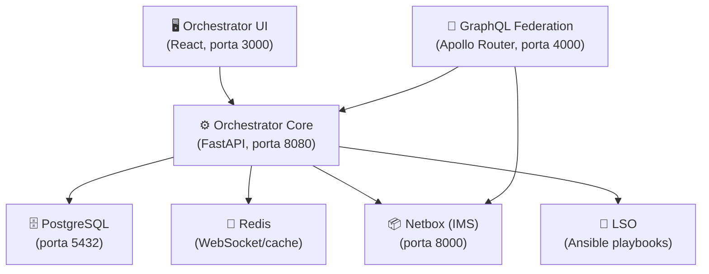
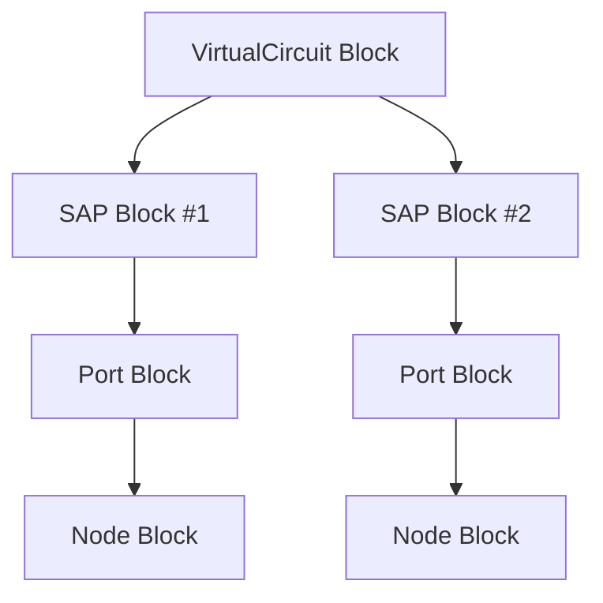
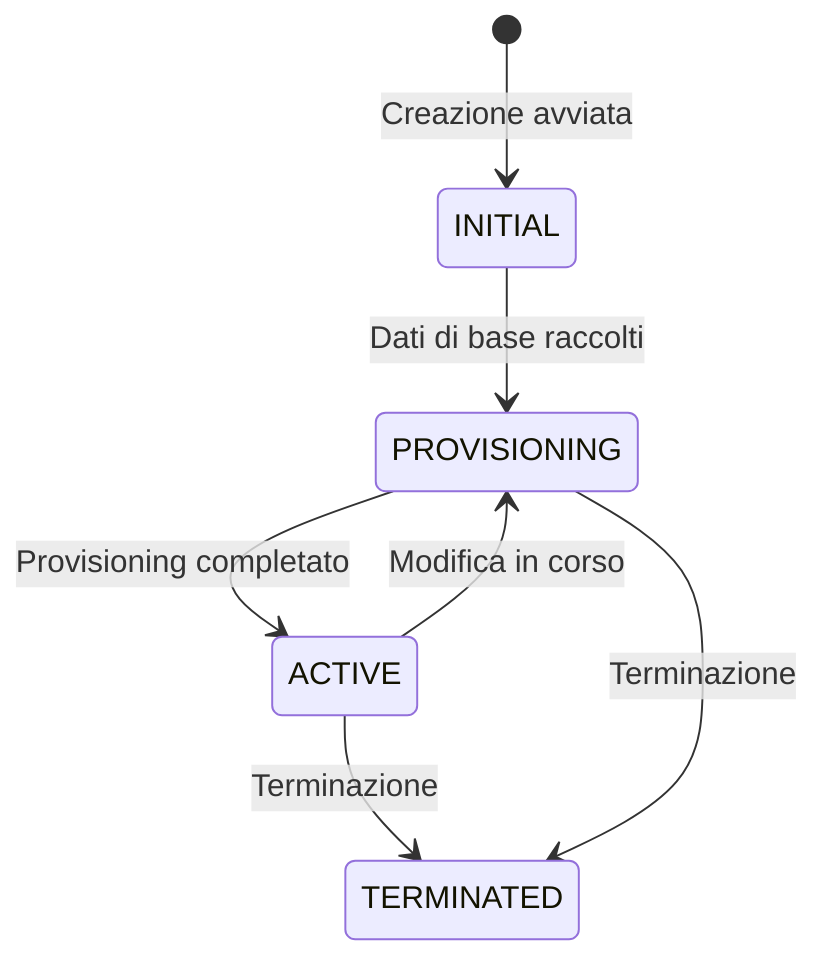
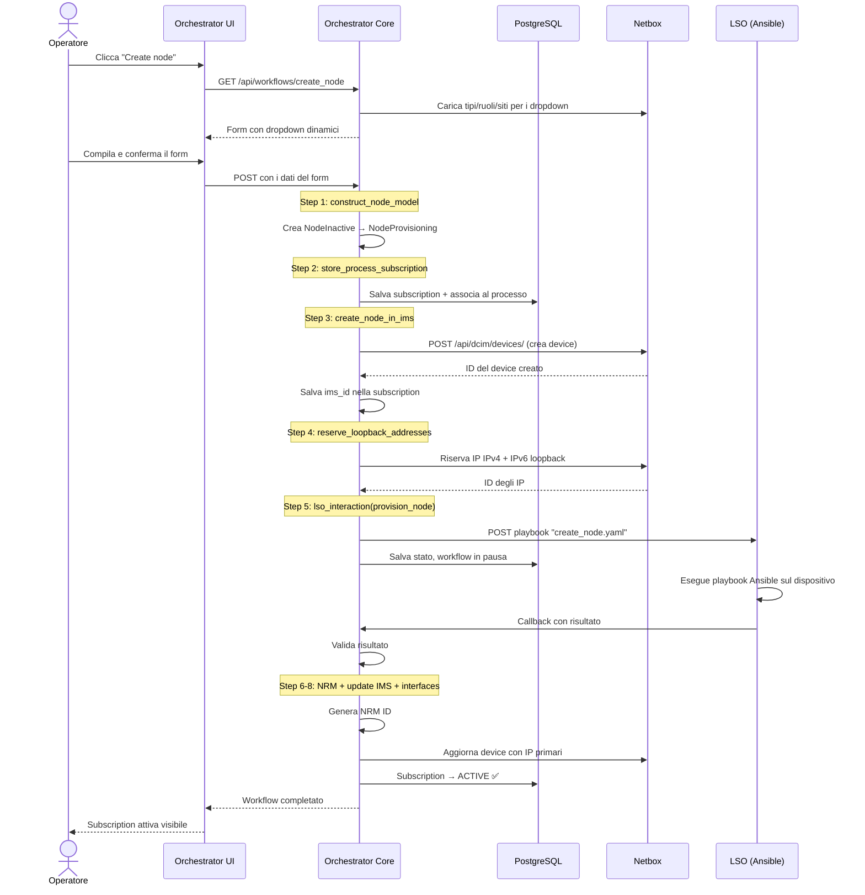

# Overview del Progetto Example-Orchestrator

## Cos'è questo progetto?

Questo è un **progetto di esempio** che dimostra come usare la libreria **`orchestrator-core`** (versione 4.7.1) di [SURF](https://www.surf.nl/) / [WorkflowOrchestrator](https://github.com/workfloworchestrator). L'orchestratore è uno strumento per **gestire il ciclo di vita di prodotti di rete** (nodi, porte, connessioni, VPN, ecc.) attraverso workflow automatizzati.

In pratica: immagina di gestire una rete di telecomunicazioni. Ogni volta che vuoi aggiungere un router, creare una connessione fra due nodi, o attivare una VPN, devi compiere una serie di passaggi ordinati (creare l'entità nel database, registrarla nel sistema di inventario, configurare il dispositivo fisico, ecc.). L'orchestratore **automatizza e traccia** tutti questi passaggi.

---

## Architettura ad alto livello



| Componente | Ruolo |
|---|---|
| **Orchestrator Core** | Il cuore: espone API REST/GraphQL, esegue i workflow, gestisce le subscription nel DB |
| **Orchestrator UI** | Interfaccia web per operatori: avviare workflow, vedere subscription, ecc. |
| **PostgreSQL** | Database dove risiedono prodotti, subscription, processi (workflow in esecuzione) |
| **Redis** | Broker per WebSocket (aggiornamenti in tempo reale alla UI) |
| **Netbox** | Sistema di **Inventory Management (IMS)**: tiene traccia dei dispositivi fisici di rete |
| **LSO** | **Lightweight Service Orchestrator**: esegue playbook Ansible per configurare dispositivi reali |
| **GraphQL Federation** | Apollo Router che unifica gli schema GraphQL di orchestratore e Netbox |

---

## I Concetti Fondamentali della Libreria

### 1. 🧱 Product Block (Blocco Prodotto)

Un **Product Block** è il mattone base del modello dati. Rappresenta un componente riutilizzabile con i suoi attributi. Ad esempio, un "Nodo" di rete ha un nome, uno status, un ID nel sistema di inventario, ecc.

Ogni Product Block viene definito come una **classe Python** che estende `ProductBlockModel` dalla libreria:

```python
# products/product_blocks/node.py

class NodeBlockInactive(ProductBlockModel, product_block_name="Node"):
    role_id: int | None = None
    type_id: int | None = None
    site_id: int | None = None
    node_status: str | None = None
    node_name: str | None = None
    node_description: str | None = None
    ims_id: int | None = None        # ID nel sistema IMS (Netbox)
    nrm_id: int | None = None        # ID nel Network Resource Manager
    ipv4_ipam_id: int | None = None   # ID indirizzo IPv4 in IPAM
    ipv6_ipam_id: int | None = None   # ID indirizzo IPv6 in IPAM
```

> [!IMPORTANT]
> La keyword `product_block_name="Node"` collega questa classe Python al nome del Product Block nel database dell'orchestratore.

#### Esempio di composizione: i Product Block possono contenere altri Product Block



Ad esempio, un `VirtualCircuitBlock` contiene una lista di `SAPBlock` (Service Access Point), ognuno dei quali punta a un `PortBlock`, che a sua volta punta a un `NodeBlock`. Questa composizione è espressa tramite **campi tipizzati**:

```python
class SAPBlockProvisioning(SAPBlockInactive, lifecycle=[SubscriptionLifecycle.PROVISIONING]):
    port: PortBlockProvisioning   # <-- riferimento ad un altro Product Block
    vlan: VlanRanges
    ims_id: int | None = None
```

I Product Block nel progetto sono:

| Product Block | File | Descrizione |
|---|---|---|
| **Node** | [node.py](file:///home/simona/dev/example-orchestrator/products/product_blocks/node.py) | Dispositivo di rete (router/switch) |
| **Port** | [port.py](file:///home/simona/dev/example-orchestrator/products/product_blocks/port.py) | Porta fisica su un nodo |
| **CorePort** | [core_port.py](file:///home/simona/dev/example-orchestrator/products/product_blocks/core_port.py) | Porta di una connessione core (backbone) |
| **CoreLink** | [core_link.py](file:///home/simona/dev/example-orchestrator/products/product_blocks/core_link.py) | Connessione fisica fra due nodi |
| **SAP** | [sap.py](file:///home/simona/dev/example-orchestrator/products/product_blocks/sap.py) | Service Access Point (porta + VLAN) |
| **VirtualCircuit** | [virtual_circuit.py](file:///home/simona/dev/example-orchestrator/products/product_blocks/virtual_circuit.py) | Circuito virtuale (insieme di SAP) |
| **Nsistp** | [nsistp.py](file:///home/simona/dev/example-orchestrator/products/product_blocks/nsistp.py) | Network Service Interface STP |

---

### 2. 🔄 Subscription Lifecycle (Ciclo di Vita)

Questo è un concetto **cruciale**. Ogni subscription (istanza di un prodotto) attraversa diversi **stati del ciclo di vita**:



| Stato | Significato |
|---|---|
| **INITIAL** | La subscription è appena stata creata, ancora vuota |
| **PROVISIONING** | In fase di configurazione, i dati essenziali sono stati inseriti |
| **ACTIVE** | Completamente operativa, tutti i campi obbligatori sono valorizzati |
| **TERMINATED** | Dismessa, non più in uso |

#### Perché 3 classi per ogni Product Block?

La libreria usa il lifecycle per imporre **vincoli di validazione diversi** a seconda della fase. Per questo, ogni Product Block ha **3 varianti di classe**:

```python
# Fase INITIAL: tutti i campi sono opzionali
class NodeBlockInactive(ProductBlockModel, product_block_name="Node"):
    ims_id: int | None = None   # opzionale
    nrm_id: int | None = None   # opzionale

# Fase PROVISIONING: campi chiave diventano obbligatori
class NodeBlockProvisioning(NodeBlockInactive, lifecycle=[SubscriptionLifecycle.PROVISIONING]):
    node_name: str              # ORA OBBLIGATORIO!
    ims_id: int | None = None   # ancora opzionale

# Fase ACTIVE: tutto obbligatorio
class NodeBlock(NodeBlockProvisioning, lifecycle=[SubscriptionLifecycle.ACTIVE]):
    ims_id: int                 # ORA OBBLIGATORIO!
    nrm_id: int                 # ORA OBBLIGATORIO!
```

> [!TIP]
> Questo pattern garantisce che una subscription non possa diventare ACTIVE se mancano dati fondamentali (come l'`ims_id` che viene assegnato dal sistema di inventario).

---

### 3. 📦 Product Type (Tipo di Prodotto)

Un **Product Type** è il prodotto vero e proprio che viene venduto/erogato. Estende `SubscriptionModel` e contiene uno o più Product Block. Può anche avere **fixed inputs** (parametri fissi al momento della creazione).

```python
# products/product_types/node.py

class Node_Type(strEnum):      # Fixed input: tipo di hardware
    Cisco = "Cisco"
    Nokia = "Nokia"
    Cumulus = "Cumulus"
    FRR = "FRR"

class NodeInactive(SubscriptionModel, is_base=True):
    node_type: Node_Type        # <-- Fixed input
    node: NodeBlockInactive     # <-- Product Block annidato

class NodeProvisioning(NodeInactive, lifecycle=[SubscriptionLifecycle.PROVISIONING]):
    node_type: Node_Type
    node: NodeBlockProvisioning

class Node(NodeProvisioning, lifecycle=[SubscriptionLifecycle.ACTIVE]):
    node_type: Node_Type
    node: NodeBlock
```

I Product Type del progetto sono:

| Product Type | Contiene | Fixed Inputs | Descrizione |
|---|---|---|---|
| **Node** | `NodeBlock` | `node_type` (Cisco/Nokia/...) | Dispositivo di rete |
| **Port** | `PortBlock` | `speed` (1G/10G/100G/...) | Porta fisca |
| **CoreLink** | `CoreLinkBlock` → 2x `CorePortBlock` | `speed` | Collegamento backbone |
| **L2vpn** | `VirtualCircuitBlock` → N x `SAPBlock` | nessuno | VPN di livello 2 |
| **Nsistp** | `NsistpBlock` → `SAPBlock` | nessuno | NSI Service Termination Point |
| **Nsip2p** | `VirtualCircuitBlock` → 2x `SAPBlock` | nessuno | NSI Point-to-Point |

---

### 4. 📋 SUBSCRIPTION_MODEL_REGISTRY

Questo è il **registro globale** che mappa il **nome del prodotto nel database** alla **classe Python** corrispondente. Viene popolato in [products/__init__.py](file:///home/simona/dev/example-orchestrator/products/__init__.py):

```python
from orchestrator.domain import SUBSCRIPTION_MODEL_REGISTRY

SUBSCRIPTION_MODEL_REGISTRY.update({
    "node Cisco": Node,
    "node Nokia": Node,
    "node Cumulus": Node,
    "node FRR": Node,
    "port 10G": Port,
    "port 100G": Port,
    "core link 10G": CoreLink,
    "core link 100G": CoreLink,
    "l2vpn": L2vpn,
    "nsistp": Nsistp,
    "nsip2p": Nsip2p,
})
```

> [!NOTE]
> Nota come più nomi di prodotto DB (es. "node Cisco", "node Nokia") possano mappare alla **stessa classe Python** `Node`. La differenza è nel **fixed input** `node_type`.

Quando l'orchestratore carica una subscription dal database, usa questo registro per sapere quale classe Python istanziare, garantendo validazione automatica e accesso tipizzato ai dati.

---

### 5. ⚡ Workflow

Un **Workflow** è una sequenza ordinata di **step** che implementa un'operazione sul ciclo di vita di un prodotto. La libreria offre 4 tipi predefiniti:

| Tipo | Decoratore | Quando si usa |
|---|---|---|
| **Create** | `@create_workflow` | Per creare una nuova subscription |
| **Modify** | `@modify_workflow` | Per modificare una subscription esistente |
| **Terminate** | `@terminate_workflow` | Per dismettere una subscription |
| **Validate** | `@validate_workflow` | Per verificare la coerenza dei dati |

#### Anatomia di un workflow: `create_node`

Vediamo il workflow più completo, [create_node.py](file:///home/simona/dev/example-orchestrator/workflows/node/create_node.py):

```python
@create_workflow("Create node", initial_input_form=initial_input_form_generator)
def create_node() -> StepList:
    return (
        begin
        >> construct_node_model           # 1. Costruisce il modello subscription
        >> store_process_subscription(Target.CREATE)  # 2. Salva nel DB
        >> create_node_in_ims             # 3. Crea il device in Netbox
        >> reserve_loopback_addresses     # 4. Riserva IP loopback in Netbox
        >> lso_interaction(provision_node) # 5. Configura il dispositivo via Ansible
        >> provision_node_in_nrm          # 6. Registra nel NRM
        >> update_node_in_ims             # 7. Aggiorna Netbox con info complete
        >> if_auto_add_ifaces(...)        # 8. (Opzionale) aggiunge interfacce
    )
```

- L'operatore `>>` concatena gli step in sequenza
- `begin` è il punto di partenza (step vuoto iniziale)
- Ogni step riceve e produce uno **State** (dizionario chiave-valore) che funge da contesto condiviso

---

### 6. 🪜 Step

Uno **Step** è una singola unità di lavoro all'interno di un workflow. Si definisce con il decoratore `@step`:

```python
@step("Create node in IMS")
def create_node_in_ims(subscription: NodeProvisioning) -> State:
    payload = build_payload(subscription.node, subscription)
    subscription.node.ims_id = netbox.create(payload)
    return {"subscription": subscription, "payload": payload.dict()}
```

Regole fondamentali degli step:
- I **parametri** vengono automaticamente estratti dallo State corrente (dependency injection)
- Il **return** è un dizionario che viene **mergiato** nello State per gli step successivi
- Il parametro speciale `subscription` viene automaticamente caricato dal DB se presente nello State
- Se uno step fallisce (eccezione), il workflow si **ferma** e può essere riprovato dalla UI

> [!IMPORTANT]
> L'orchestratore **salva automaticamente** lo stato dopo ogni step. Se il processo crasha, può riprendere dall'ultimo step completato con successo.

---

### 7. 📝 Forms (Input dell'Utente)

I form raccolgono input dall'operatore prima di eseguire il workflow. Si definiscono come classi Pydantic che estendono `FormPage`:

```python
def initial_input_form_generator(product_name: str, product: UUIDstr) -> FormGenerator:
    # Genera dinamicamente le possibili scelte da Netbox
    NodeTypeChoice = node_type_selector(node_type)
    NodeRoleChoice = node_role_selector()
    SiteChoice = site_selector()

    class CreateNodeForm(FormPage):
        model_config = ConfigDict(title=product_name)

        auto_add_interfaces: bool = True
        node_settings: Label                # Etichetta visiva
        type_id: NodeTypeChoice             # Dropdown dinamico
        role_id: NodeRoleChoice             # Dropdown dinamico
        site_id: SiteChoice                 # Dropdown dinamico
        node_status: NodeStatusChoice       # Enum
        node_name: str                      # Campo testo
        node_description: str | None = None # Campo opzionale

    user_input = yield CreateNodeForm       # ← YIELD = mostra il form e attende input
    user_input_dict = user_input.model_dump()

    yield from create_summary_form(...)     # Mostra riepilogo per conferma

    return user_input_dict                  # Dati finali → diventano lo State iniziale
```

Caratteristiche:
- **`yield`** un `FormPage` = mostra il form all'utente e si mette in pausa
- **`Choice`** = crea dropdown dinamici con dati dal DB/API
- **`Label`** = etichetta decorativa nel form
- **`DisplaySubscription`** = mostra dettagli di una subscription esistente
- **Summary form** = pagina di riepilogo prima di confermare
- La **validazione Pydantic** viene eseguita automaticamente sia client che server-side

---

### 8. 📎 LazyWorkflowInstance

Questo meccanismo **registra i workflow** nell'orchestratore senza importarli immediatamente (lazy loading). Definito in [workflows/__init__.py](file:///home/simona/dev/example-orchestrator/workflows/__init__.py):

```python
from orchestrator.workflows import LazyWorkflowInstance

LazyWorkflowInstance("workflows.node.create_node", "create_node")
LazyWorkflowInstance("workflows.node.modify_node", "modify_node")
LazyWorkflowInstance("workflows.node.terminate_node", "terminate_node")
LazyWorkflowInstance("workflows.node.validate_node", "validate_node")
# ...per ogni workflow
```

- **Primo argomento**: percorso Python del modulo (es. `workflows.node.create_node`)
- **Secondo argomento**: nome della funzione workflow all'interno del modulo

> [!NOTE]
> Il workflow non viene caricato in memoria finché non viene effettivamente richiesto (performance).

---

### 9. 🔗 Callback Step e LSO Interaction

Per operazioni asincrone (come configurare un dispositivo via Ansible), la libreria offre il pattern **callback step**:

```python
def lso_interaction(provisioning_step: Step) -> StepList:
    lso_is_enabled = conditional(lambda _: getenv("LSO_ENABLED") == "True")
    return begin >> lso_is_enabled(
        begin
        >> callback_step(
            name=provisioning_step.name,
            action_step=provisioning_step,        # Invia richiesta a LSO
            validate_step=_evaluate_results,       # Valida la risposta
        )
        >> _show_results                           # Mostra risultati all'operatore
    )
```

Come funziona:
1. Lo **action_step** invia una richiesta HTTP a LSO con una **callback URL**
2. Il workflow si **mette in pausa** e lo stato viene salvato nel DB
3. Quando LSO completa il playbook Ansible, fa una chiamata HTTP alla callback URL
4. Il workflow **riprende** con il risultato nel State
5. Il **validate_step** controlla se l'operazione è andata a buon fine

> [!TIP]
> Il `conditional` permette di saltare un intero blocco di step se una condizione non è soddisfatta (es. `LSO_ENABLED != "True"`).

---

### 10. 🔀 Workflow Utilities della Libreria

La libreria fornisce diversi helper usati nel progetto:

| Utility | Da dove viene | Cosa fa |
|---|---|---|
| `store_process_subscription(Target.CREATE)` | `orchestrator.workflows.steps` | Associa la subscription al processo workflow nel DB |
| `ensure_provisioning_status` | `orchestrator.workflows.utils` | Decoratore: porta la subscription in stato PROVISIONING prima dello step |
| `conditional(lambda)` | `orchestrator.workflow` | Esegue un blocco di step solo se la condizione è vera |
| `callback_step(...)` | `orchestrator.workflow` | Step asincrono con callback HTTP |
| `begin` | `orchestrator.workflow` | Punto di partenza di una catena di step |
| `inputstep(...)` | `orchestrator.workflow` | Step che richiede input dell'utente a metà workflow |

---

## Integrazione con Sistemi Esterni

### Netbox (IMS - Inventory Management System)

In [services/netbox.py](file:///home/simona/dev/example-orchestrator/services/netbox.py) c'è un modulo completo di integrazione con Netbox tramite la libreria `pynetbox`. Definisce:

- **Payload dataclass** (`DevicePayload`, `InterfacePayload`, `CablePayload`, ecc.) → strutture dati per creare/modificare oggetti in Netbox
- **Funzioni CRUD** (`create`, `update`, `delete_device`, ecc.) → operazioni sul API di Netbox
- **Generic dispatch** con `@singledispatch` → il metodo `create()` sa come creare automaticamente il tipo giusto di oggetto Netbox in base al tipo di payload

In [products/services/netbox/netbox.py](file:///home/simona/dev/example-orchestrator/products/services/netbox/netbox.py) c'è il **`build_payload`**, anche questo basato su singledispatch, che converte un Product Block in un payload Netbox:

```python
@singledispatch
def build_payload(model, subscription, **kwargs) -> netbox.NetboxPayload:
    ...

@build_payload.register
def _(model: NodeBlockProvisioning, subscription, **kwargs) -> netbox.DevicePayload:
    return build_node_payload(model, subscription)
```

### LSO (Lightweight Service Orchestrator)

In [services/lso_client.py](file:///home/simona/dev/example-orchestrator/services/lso_client.py) c'è il client che comunica con LSO:

- `execute_playbook()` → invia una richiesta HTTP a LSO per eseguire un playbook Ansible
- `lso_interaction()` → wrappa uno step in un pattern callback asincrono
- `indifferent_lso_interaction()` → come sopra, ma non fallisce se il playbook fallisce

---

## Templates YAML

I file in [templates/](file:///home/simona/dev/example-orchestrator/templates/) descrivono la struttura dei prodotti in formato YAML. Vengono usati per **generare codice e migrazioni DB**:

```yaml
# templates/node.yaml
name: node
type: Node
tag: NODE
description: "Network node"
fixed_inputs:
  - name: node_type
    type: enum
    values: ["Cisco", "Nokia"]
product_blocks:
  - name: node
    type: Node
    tag: NODE
    fields:
      - name: node_name
        type: str
        required: provisioning    # ← Diventa obbligatorio in fase PROVISIONING
        modifiable:               # ← Può essere modificato dopo la creazione
      - name: ims_id
        type: int
        required: active          # ← Diventa obbligatorio solo in fase ACTIVE
```

---

## Traduzioni

In [translations/en-GB.json](file:///home/simona/dev/example-orchestrator/translations/en-GB.json) ci sono le etichette testuali per la UI, come nomi dei campi dei form e nomi dei workflow.

---

## GraphQL Federation

In [graphql_federation.py](file:///home/simona/dev/example-orchestrator/graphql_federation.py) viene configurato il supporto per **GraphQL Federation** usando Strawberry:

```python
@strawberry.federation.type(keys=["id"])
class DeviceType:
    id: strawberry.ID

@strawberry.experimental.pydantic.type(model=_NodeBlockInactive, all_fields=True)
class NodeBlockInactive:
    @strawberry.field(description="Get netbox device by IMS ID")
    def netbox_device(self) -> DeviceType | None:
        return DeviceType(id=self.ims_id) if self.ims_id else None
```

Questo permette di fare query GraphQL che attraversano i confini fra Orchestratore e Netbox, risolvendo automaticamente i dati da entrambi i sistemi.

---

## Entry Points dell'Applicazione

### `wsgi.py` — Avvio del server web

```python
from orchestrator import OrchestratorCore
from orchestrator.settings import AppSettings

import products  # ← Eseguito per side-effect: registra i Product Type
import workflows  # ← Eseguito per side-effect: registra i Workflow

app = OrchestratorCore(base_settings=AppSettings())
app.register_graphql(graphql_models=CUSTOM_GRAPHQL_MODELS)
```

> [!IMPORTANT]
> Gli `import products` e `import workflows` **non usano** direttamente gli oggetti importati. Sono eseguiti per i **side-effect**: il semplice import esegue il codice nei rispettivi `__init__.py`, che registra le classi nel `SUBSCRIPTION_MODEL_REGISTRY` e i workflow via `LazyWorkflowInstance`.

### `main.py` — CLI

Fornisce un'interfaccia a riga di comando basata su Typer per operazioni di manutenzione (migrazioni DB, ecc.).

---

## Struttura Completa del Progetto

```
example-orchestrator/
├── 📄 wsgi.py                    # Entry point web (FastAPI app)
├── 📄 main.py                    # Entry point CLI
├── 📄 settings.py                # Configurazione applicazione (Netbox URL, prefissi IP)
├── 📄 graphql_federation.py      # Schema GraphQL custom + Federation
├── 📄 docker-compose.yml         # Infrastruttura (tutti i servizi)
├── 📄 alembic.ini                # Configurazione migrazioni DB
│
├── 📁 products/                  # DOMAIN MODEL
│   ├── __init__.py               # ← Registra i Product Type nel registry
│   ├── 📁 product_blocks/        # Mattoni base (NodeBlock, PortBlock, ...)
│   │   ├── node.py
│   │   ├── port.py
│   │   ├── core_link.py
│   │   ├── core_port.py
│   │   ├── sap.py
│   │   ├── virtual_circuit.py
│   │   ├── nsistp.py
│   │   └── 📁 shared/types.py   # Tipi condivisi (NodeStatus enum)
│   ├── 📁 product_types/         # Prodotti vendibili (Node, Port, L2vpn, ...)
│   │   ├── node.py
│   │   ├── port.py
│   │   ├── core_link.py
│   │   ├── l2vpn.py
│   │   ├── nsistp.py
│   │   └── nsip2p.py
│   └── 📁 services/              # Logica di dominio
│       ├── description.py        # Genera descrizioni leggibili delle subscription
│       └── 📁 netbox/            # Costruisce payload per Netbox
│
├── 📁 workflows/                 # BUSINESS LOGIC
│   ├── __init__.py               # ← Registra tutti i workflow (LazyWorkflowInstance)
│   ├── shared.py                 # Funzioni condivise fra workflow
│   ├── 📁 node/                  # Workflow per Node (create/modify/terminate/validate)
│   ├── 📁 port/                  # Workflow per Port
│   ├── 📁 core_link/             # Workflow per CoreLink
│   ├── 📁 l2vpn/                 # Workflow per L2VPN
│   ├── 📁 nsistp/                # Workflow per NSISTP
│   ├── 📁 nsip2p/                # Workflow per NSIP2P
│   └── 📁 tasks/                 # Task speciali (bootstrap/wipe Netbox)
│
├── 📁 services/                  # INTEGRAZIONE SISTEMI ESTERNI
│   ├── netbox.py                 # Client Netbox (pynetbox wrapper)
│   └── lso_client.py             # Client LSO (Ansible callback)
│
├── 📁 templates/                 # Definizioni YAML dei prodotti
├── 📁 translations/              # Traduzioni UI
├── 📁 migrations/                # Migrazioni DB (Alembic)
└── 📁 docker/                    # Configurazioni Docker dei servizi
```

---

## Flusso tipico: "Creare un Nodo"

Ecco passo-passo cosa succede quando un operatore crea un nodo dalla UI:



---

## Riepilogo dei Concetti Chiave

| Concetto | Cosa è | Dove si definisce |
|---|---|---|
| **Product Block** | Componente riusabile del modello dati | `products/product_blocks/` |
| **Product Type** | Prodotto vendibile (composto di Product Block) | `products/product_types/` |
| **Subscription** | Istanza di un Product Type nel database | Creata dai workflow |
| **Subscription Lifecycle** | Stato della subscription (Initial → Provisioning → Active) | Classi con `lifecycle=[...]` |
| **SUBSCRIPTION_MODEL_REGISTRY** | Mappa nome prodotto DB → classe Python | `products/__init__.py` |
| **Workflow** | Sequenza di step per un'operazione | `workflows/*/` |
| **Step** | Singola unità di lavoro, decorata con `@step` | Dentro i file workflow |
| **Form** | Input dell'utente, classi `FormPage` + `yield` | `initial_input_form_generator` |
| **LazyWorkflowInstance** | Registrazione lazy dei workflow | `workflows/__init__.py` |
| **Callback Step** | Pattern asincrono per operazioni lunghe (LSO) | `services/lso_client.py` |
| **State** | Dizionario condiviso fra step di un workflow | Return di ogni step |
| **Fixed Input** | Parametro immutabile del prodotto (es. `node_type`) | Template YAML / Product Type |
| **build_payload** | Converte Product Block → payload per sistema esterno | `products/services/netbox/` |
| **OrchestratorCore** | L'applicazione FastAPI principale | `wsgi.py` |
